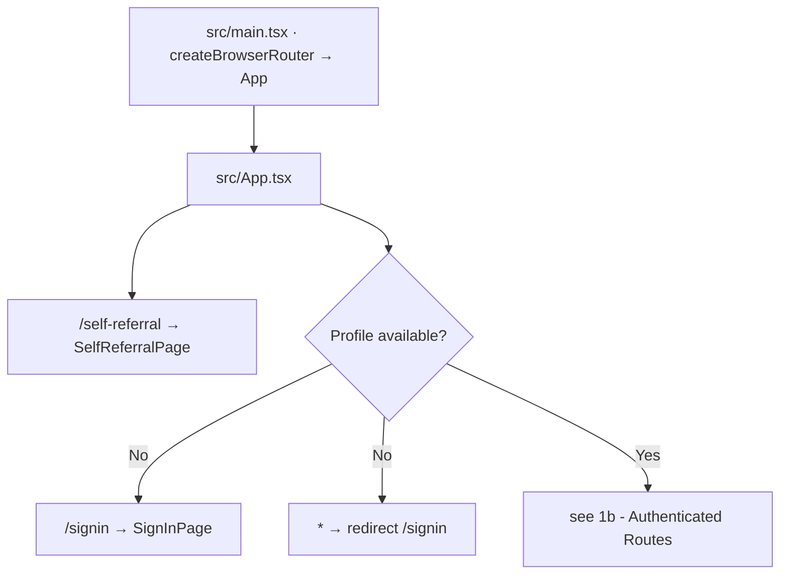
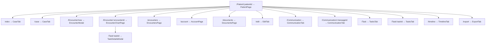
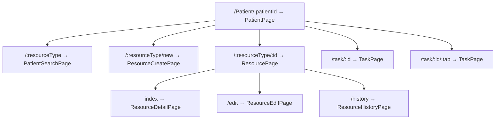
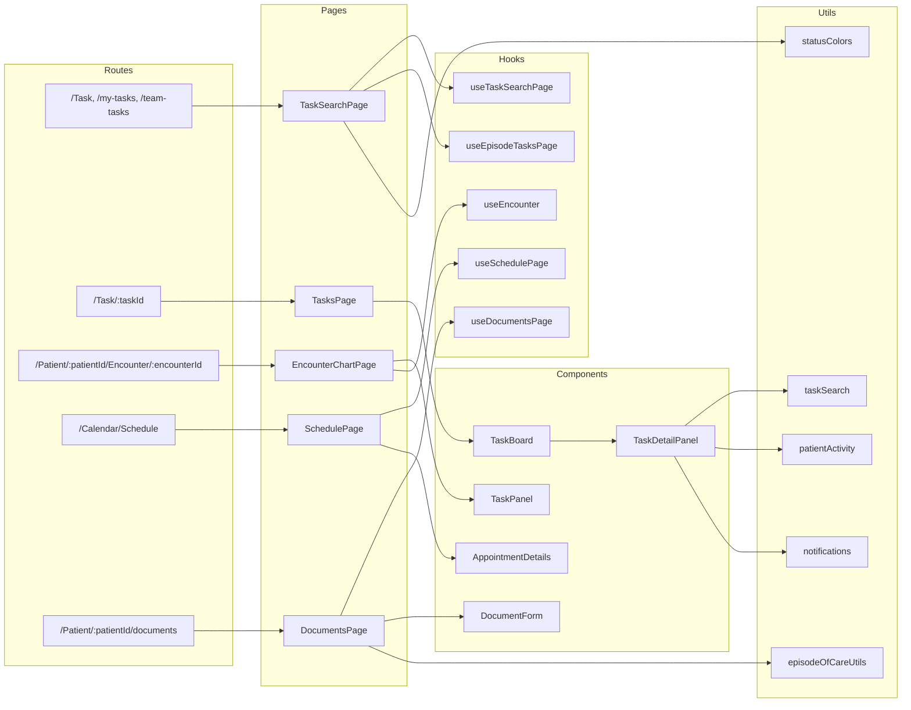
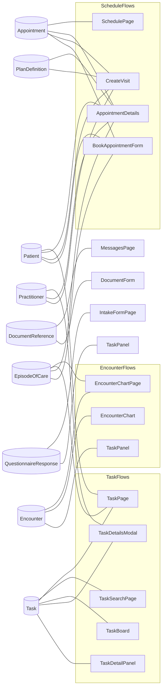

# Chimera App Flow Documentation

This document maps:

- Route flow (top-level and nested)
- Routed pages and their major component dependencies
- Hooks and utils used by routed surfaces
- FHIR/Medplum resources used by pages and route-critical components

Scope notes:

- Source of truth for routing is `src/main.tsx` and `src/App.tsx`.
- "FHIR resources used" means direct usage in the file (imports from `@medplum/fhirtypes`, `resourceType` literals, or Medplum read/search/create/update calls).
- This is focused on routed pages and route-critical components, not every leaf UI component.

## 1a) Router Entry, Public Routes And Auth Gate

## 1b) Authenticated Routes

```mermaid
flowchart TD
  AUTH[Profile available]

  AUTH --> ROOT["/ → redirect Patient list or Calendar"]
  AUTH --> PNEW["/Patient/new → ResourceCreatePage"]
  AUTH --> PPAT["/Patient/:patientId → PatientPage"]
  AUTH --> COMM["/Communication → MessagesPage"]
  AUTH --> TASKID["/Task/:id → TaskPage"]
  AUTH --> TASKSEARCH["/Task, /my-tasks, /team-tasks → TaskSearchPage"]
  AUTH --> TASKDETAIL["/Task/:taskId → TasksPage"]
  AUTH --> INTAKE["/intake → IntakeFormPage"]
  AUTH --> INTAKENEW["/intake/new → PatientIntakeFormPage"]
  AUTH --> ODS1["/utilities/gp-lookup → OdsSearchPage"]
  AUTH --> ODS2["/utilities/gp-practices → OdsSearchOrganisationPage"]
  AUTH --> FIND["/findPatient → FindPatientPage"]
  AUTH --> PATS["/Patients → PatientsPage"]
  AUTH --> CASES["/my-cases → CareManagerCasesPage"]
  AUTH --> RECENT["/recentPatients → RecentPatients"]
  AUTH --> CAL1["/Calendar/Schedule → SchedulePage"]
  AUTH --> CAL2["/Calendar/Schedule/:id → SchedulePage"]
  AUTH --> CAL3["/Calendar/ServiceSchedule → ServiceSchedulePage"]
  AUTH --> RS["/:resourceType → SearchPage"]
  AUTH --> RC["/:resourceType/new → ResourceCreatePage"]
  AUTH --> RP["/:resourceType/:id → ResourcePage"]
```

## 2a) Nested Patient Route Flow — Clinical Routes

## 2b) Nested Patient Route Flow — Resource And Task Routes

## 3) Route To Page To Major Dependencies

## 4) Routed Pages: Hooks, Utils, FHIR/Medplum Resources

| Page (file)                                                                     | Route(s)                                             | Hooks used                                                               | Utils used                                        | FHIR/Medplum resources used in file                                           |
| ------------------------------------------------------------------------------- | ---------------------------------------------------- | ------------------------------------------------------------------------ | ------------------------------------------------- | ----------------------------------------------------------------------------- | --------------- |
| AccountPage (`src/pages/account/AccountPage.tsx`)                               | `/Patient/:patientId/account`                        | `useAccount`                                                             | `statusColors`                                    | None direct                                                                   |
| PatientsPage (`src/pages/allPatients/PatientsPage.tsx`)                         | `/Patients`                                          | `useSortResults`, `usePatientsPage`                                      | `patientUtils`                                    | `Patient`                                                                     |
| CareManagerCasesPage (`src/pages/careManager/CareManagerCasesPage.tsx`)         | `/my-cases`                                          | `useSortResults`, `useCareManagerCases`                                  | `statusColors`                                    | None direct                                                                   |
| DocumentsPage (`src/pages/document/DocumentsPage.tsx`)                          | `/Patient/:patientId/documents`                      | `useSortResults`, `useDocumentsPage`                                     | `episodeOfCareUtils`, `statusColors`, `timeUtils` | None direct                                                                   |
| EncounterChartPage (`src/pages/encounter/EncounterChartPage.tsx`)               | `/Patient/:patientId/Encounter/:encounterId`         | `useActiveEpisode`                                                       | `notifications`                                   | `Encounter`, `EpisodeOfCare`; `medplum.readResource(Encounter)`               |
| EncounterModal (`src/pages/encounter/EncounterModal.tsx`)                       | `/Patient/:patientId/Encounter/new`                  | `useEncounterModal`                                                      | `scheduling`                                      | `EpisodeOfCare`, `PlanDefinition`, `Practitioner`; `resourceType=Practitioner | PlanDefinition` |
| EncountersPage (`src/pages/encounter/EncountersPage.tsx`)                       | `/Patient/:patientId/encounters`                     | `useEncountersPage`                                                      | `episodeOfCareUtils`, `statusColors`, `timeUtils` | None direct                                                                   |
| FindPatientPage (`src/pages/findPatient/FindPatientPage.tsx`)                   | `/findPatient`                                       | `useSortResults`, `useFindPatientPage`                                   | `patientUtils`                                    | `Patient`                                                                     |
| MessagesPage (`src/pages/messages/MessagesPage.tsx`)                            | `/Communication`, `/Communication/:messageId`        | None direct                                                              | `communicationSearch`                             | `Communication`, `DocumentReference`                                          |
| OdsSearchPage (`src/pages/odsSearch/OdsSearchPage.tsx`)                         | `/utilities/gp-lookup`                               | `useSortResults`, `useOdsSearch`                                         | None direct                                       | None direct                                                                   |
| OdsSearchOrganisationPage (`src/pages/odsSearch/OdsSearchOrganisationPage.tsx`) | `/utilities/gp-practices`                            | `useSortResults`, `useOdsSearchOrganisation`                             | None direct                                       | None direct                                                                   |
| IntakeFormPage (`src/pages/patient/IntakeFormPage.tsx`)                         | `/intake`                                            | `useIntakeFieldValidation`, `useIntakeFormPage`, `useServiceTypeOptions` | `intakeForm`, `notifications`                     | `Patient`, `Questionnaire`, `QuestionnaireResponse`                           |
| PatientPage (`src/pages/patient/PatientPage.tsx`)                               | `/Patient/:patientId`                                | `usePatient`                                                             | None direct                                       | `OperationOutcome`                                                            |
| PatientSearchPage (`src/pages/patient/PatientSearchPage.tsx`)                   | `/Patient/:patientId/:resourceType`                  | `usePatient`, `useResourceType`                                          | None direct                                       | None direct                                                                   |
| CaseTab (`src/pages/patient/tabs/CaseTab.tsx`)                                  | patient index, `/case`                               | `usePatient`                                                             | None direct                                       | None direct                                                                   |
| CommunicationTab (`src/pages/patient/tabs/CommunicationTab.tsx`)                | patient communication routes                         | None direct                                                              | `communicationSearch`                             | `Communication`                                                               |
| EditTab (`src/pages/patient/tabs/EditTab.tsx`)                                  | `/Patient/:patientId/edit`                           | None direct                                                              | `patientActivity`                                 | `OperationOutcome`, `Resource`                                                |
| ExportTab (`src/pages/patient/tabs/ExportTab.tsx`)                              | `/Patient/:patientId/export`                         | None                                                                     | None                                              | None direct                                                                   |
| TasksTab (`src/pages/patient/tabs/TasksTab.tsx`)                                | `/Patient/:patientId/Task[/:taskId]`                 | None direct                                                              | None                                              | None direct                                                                   |
| TimelineTab (`src/pages/patient/tabs/TimelineTab.tsx`)                          | `/Patient/:patientId/timeline`                       | `usePatient`                                                             | None                                              | None direct                                                                   |
| PatientIntakeFormPage (`src/pages/patientIntake/PatientIntakeFormPage.tsx`)     | `/intake/new`                                        | `usePatientIntakeForm`                                                   | None                                              | `Organization`; `resourceType=Organization`                                   |
| RecentPatients (`src/pages/recentPatients/RecentPatients.tsx`)                  | `/recentPatients`                                    | `useRecentPatients`                                                      | `patientUtils`                                    | None direct                                                                   |
| ResourceCreatePage (`src/pages/resource/ResourceCreatePage.tsx`)                | `/Patient/new`, patient nested create, global create | `usePatient`                                                             | None                                              | `Patient`, `OperationOutcome`, `ResourceType`                                 |
| ResourceDetailPage (`src/pages/resource/ResourceDetailPage.tsx`)                | nested resource index                                | None direct                                                              | None                                              | None direct                                                                   |
| ResourceEditPage (`src/pages/resource/ResourceEditPage.tsx`)                    | nested resource edit                                 | None direct                                                              | `patientActivity`                                 | `OperationOutcome`, `ResourceType`                                            |
| ResourceHistoryPage (`src/pages/resource/ResourceHistoryPage.tsx`)              | nested resource history                              | None direct                                                              | None                                              | `ResourceType`                                                                |
| ResourcePage (`src/pages/resource/ResourcePage.tsx`)                            | patient/global resource detail host                  | `useResourceType`                                                        | None                                              | `Resource`, `ResourceType`                                                    |
| SchedulePage (`src/pages/schedule/SchedulePage.tsx`)                            | `/Calendar/Schedule[/:id]`                           | `useSchedulePage`                                                        | None direct                                       | `Practitioner`; selection input uses `resourceType=Practitioner`              |
| SearchPage (`src/pages/search/SearchPage.tsx`)                                  | `/:resourceType`                                     | `useResourceType`                                                        | None                                              | `Patient`, `UserConfiguration`, `Resource`                                    |
| SelfReferralPage (`src/pages/selfReferral/SelfReferralPage.tsx`)                | `/self-referral`                                     | `useSelfReferralStore`                                                   | None                                              | None direct                                                                   |
| ServiceSchedulePage (`src/pages/serviceSchedule/ServiceSchedulePage.tsx`)       | `/Calendar/ServiceSchedule`                          | `useServiceSchedulePage`                                                 | None                                              | None direct                                                                   |
| SignInPage (`src/pages/signin/SignInPage.tsx`)                                  | `/signin`                                            | None direct                                                              | None                                              | None direct                                                                   |
| TaskPage (`src/pages/tasks/TaskPage.tsx`)                                       | `/Task/:id`, patient task paths                      | None direct                                                              | None                                              | `Task`, `Patient`, `EpisodeOfCare`; `medplum.readResource(Task                | Patient)`       |
| TaskSearchPage (`src/pages/tasks/TaskSearchPage.tsx`)                           | `/Task`, `/my-tasks`, `/team-tasks`                  | `useEpisodeTasksPage`, `useSortResults`, `useTaskSearchPage`             | `statusColors`                                    | None direct                                                                   |
| TasksPage (`src/pages/tasks/TasksPage.tsx`)                                     | `/Task/:taskId`                                      | None direct                                                              | `taskSearch`                                      | `Task`                                                                        |

## 5) Route-Critical Components: Hooks, Utils, FHIR/Medplum Resources

| Component (file)                                                        | Used by route/page           | Hooks used               | Utils used                                                        | FHIR/Medplum resources used in file                                                                                        |
| ----------------------------------------------------------------------- | ---------------------------- | ------------------------ | ----------------------------------------------------------------- | -------------------------------------------------------------------------------------------------------------------------- |
| TaskDetailsModal (`src/components/tasks/TaskDetailsModal.tsx`)          | nested under encounter route | `usePatient`             | None direct                                                       | `Task`, `Practitioner`; `medplum.readResource(Task)`, `medplum.updateResource(Task)`, `resourceType=Practitioner`          |
| TaskBoard (`src/components/tasks/TaskBoard.tsx`)                        | `TasksPage`                  | `usePatient`             | `notifications`                                                   | `Task`; `medplum.search(Task)`, `medplum.readResource(Task)`                                                               |
| TaskDetailPanel (`src/components/tasks/TaskDetailPanel.tsx`)            | task route surfaces          | None direct              | `notifications`, `patientActivity`                                | `Task`; `medplum.updateResource(Task)`                                                                                     |
| TaskActions (`src/components/tasks/actions/TaskActions.tsx`)            | task route surfaces          | None direct              | None direct                                                       | `Task`                                                                                                                     |
| NewTaskModal (`src/components/tasks/NewTaskModal.tsx`)                  | task search pages            | `useNewTaskModal`        | None direct                                                       | `Task`, `Patient`, `Practitioner`; `resourceType=Patient`                                                                  |
| EncounterChart (`src/components/encounter/EncounterChart.tsx`)          | encounter chart route        | `useEncounterChart`      | None direct                                                       | `Encounter`                                                                                                                |
| TaskPanel (`src/components/tasks/encounter/TaskPanel.tsx`)              | encounter chart route        | None direct              | None direct                                                       | `Task`, `DiagnosticReport`, `QuestionnaireResponse`; task update calls                                                     |
| AppointmentDetails (`src/components/schedule/AppointmentDetails.tsx`)   | schedule pages               | None direct              | `encounter`, `encounterClass`, `notifications`, `patientActivity` | `Appointment`, `EpisodeOfCare`, `Patient`, `Practitioner`, `PlanDefinition`; update/search flows and `resourceType` inputs |
| AppointmentInfo (`src/components/schedule/AppointmentInfo.tsx`)         | schedule pages               | `useAppointmentInfo`     | None direct                                                       | `Appointment`, `Encounter`                                                                                                 |
| CreateVisit (`src/components/schedule/CreateVisit.tsx`)                 | schedule pages               | `useCreateVisit`         | `episodeOfCareUtils`, `scheduling`                                | `Patient`, `Practitioner`, `PlanDefinition`, `Schedule`; `resourceType` inputs                                             |
| BookAppointmentForm (`src/components/schedule/BookAppointmentForm.tsx`) | service schedule flows       | `useBookAppointmentForm` | `episodeOfCareUtils`                                              | `Appointment`, `EpisodeOfCare`, `Patient`, `Slot`; `resourceType=Patient`                                                  |
| DocumentForm (`src/components/document/DocumentForm.tsx`)               | document page modals         | None direct              | None direct                                                       | `DocumentReference`                                                                                                        |

## 6) Shared Hooks And Utils Worth Tracking

### Shared hooks across routes

- `usePatient`: patient context for many patient/task/encounter surfaces.
- `useSortResults`: table sorting for list-heavy pages.
- `useEpisodeTasksPage`: task search route composition logic.
- `useSchedulePage` and `useServiceSchedulePage`: calendar route state and fetch orchestration.

### Shared utils across routes

- `src/utils/statusColors.ts`: case/encounter/task visual state mapping.
- `src/utils/notifications.ts`: error and user messaging.
- `src/utils/patientActivity.ts`: patient activity/audit recording.
- `src/utils/episodeOfCareUtils.ts`: case labels and status helpers.
- `src/utils/taskSearch.ts` and `src/utils/communicationSearch.ts`: route-level filtering/search behavior.

## 7) FHIR Resource Hotspots

---

Last reviewed: 2026-07-22
